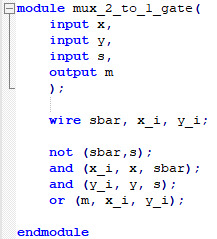

# Mux
Vivado turns all circuits into the primitives of a CLB Slice: LUTs, muxes, carry-logic, xor gates, d flip flops. Understanding these is the goal of this course. We have covered XOR gates and LUTs. The goal now is to cover muxes. 

## 1_1_m2x1Mux-1bitwide

#### Port Diagram

#### 

#### Verilog Code

#### RTL Schematic Screen shot

#### Synthesis Schematic Screen shot

#### Implementation Device screen shot zoomed in on something interesting

#### Testing

SW[0] is x, SW[1] is y, SW[2] is the select line and LED[0] is the output m. SW[2] selects SW[0] or SW[1] and connects it to the LED. 

#### **Questions**

*In the rtl schematic screen shot, the two and gates are connected to select and not select. Describe what they are doing in terms of what a mux does.*

*In the rtl schematic screen shot, what does the or gate do in terms of what a mux does?*

*How does the schematic change after running synthesis?*

*After running synthesis and implementation, clicking on synthesis under RTL, synthesis and Implementation continues to display the LUT based diagram. Not the gate based diagram. Why? Form a reasonable, non-trivial, relevant hypothesis.* 

 *The black and white design window appears first after running which step of the workflow?*

*How what can you click on to see a region of the device window change from some color to white?*

*White arrows in the screen shot above are helping us see what?* 

*How does Data flow in the fpga from left to right, right to left, bottom up, top down?*

*What is the verilog symbol for the white line going up at an angle in the device diagram?*

## lab1_1_mux2-1-2bitwide

#### Port Diagram

#### Verilog Code

#### RTL Schematic Screen shot

#### Synthesis Schematic Screen shot

#### Implementation Device screen shot zoomed in on something interesting

#### Testing

One select line now selects between two pair of inputs and displays one of the pairs on LEDs. 

### Questions

*Explain how to zoom in on the above Device Screen Shot.*

*Do you see pictures of muxes in the Device Screen Shot? Are they used?*

*Which stage of the work flow choose the specific LUT above?*

*Which stage of the work flow chooses the green lines?*

**What do the white lines represent?* 

**What do the spots where white lines cross represent?*

## lab1_2_mux2-1-tristate

### Port Diagram

#### Verilog Code

#### RTL Schematic Screen shot

#### Synthesis Schematic Screen shot

#### Implementation Device screen shot zoomed in on something interesting

#### Testing

Two muxes are implemented using the same inputs with the same select line.  So if the two are equal, their outputs should be equal.  SW[0]- a , SW[1]-b,  SW[2]-select, outputs are the first two LEDs. 

#### Questions

*In the RTL schematic, what is RTL_Mux g1_i doing?*

*Which of the two verilog implemented muxes actually created a tristate symbol in the RTL schematic?*

*After Synthesis, which of the two verilog implemented muxes looks more simple?*

*After Synthesis, why hasn't Vivado detected that the two circuits are identical?*

*After implementation, does the schematic change? If so, put a screen shot here.*

*Do the insides of the device reflect the schematic .. after implementation?*

*What are the truth tables of the one or two LUT(s)? Put a screen shot(s) here.*

*Are the truth tables the same or different? Why would Vivado do this? Is this a bug in Vivado?*

*Can you make the one line of code mux into a 4 input, 2 select line, 1 output mux in one line?*

*What are the minimum lines of code necessary to create a 4 input, 2 select line, 1 output mux?*

## lab1_2_tb_mux2-1-2bitwide

### Port Diagram

#### Verilog Code

#### Simulation Screen Shot

#### RTL Schematic Screen shot

#### Synthesis Schematic Screen shot

#### Implementation Device screen shot zoomed in on something interesting

#### Testing

#### Questions

*In the simulation, what is the cause of the red box with an X in it above?* 

*In the simulation, what do the green boxes with numbers in them mean?*

*In the simulation, was all the activity captured or are their changes to the left of the yellow vertical line?*

*Is this simulation associated with RTL, Synthesis or Implementation Vivado analysis?*

*Is this a physics simulation or logic simulation?*

## lab1_3_mux2-1-1bitwide-reg

### Port Diagram

#### Verilog Code

#### RTL Schematic Screen shot

#### Synthesis Schematic Screen shot

#### Implementation Device screen shot zoomed in on something interesting

#### Testing

## lab1_3_mux2-1-2bitwide-reg

### Port Diagram

#### Verilog Code

#### RTL Schematic Screen shot

#### Synthesis Schematic Screen shot

#### Implementation Device screen shot zoomed in on something interesting

#### Testing

## lab1_4_2-mux2-1inSequence

### Port Diagram

#### Verilog Code

#### RTL Schematic Screen shot

#### Synthesis Schematic Screen shot

#### Implementation Device screen shot zoomed in on something interesting

#### Testing

## lab1_4_bcdTo7Segment-dataflow

### Port Diagram

#### Verilog Code

#### RTL Schematic Screen shot

#### Synthesis Schematic Screen shot

#### Implementation Device screen shot zoomed in on something interesting

#### Testing

## 

## Ethics

Why are there all these different ways of implementing a mux in verilog when vivado turns them all into the same thing .. a LUT? 

If the one good, true way of implementing a mux in verilog, why not just teach/learn that?

Why would Vivado not recognize two identical circuits implemented with different verilog code?

