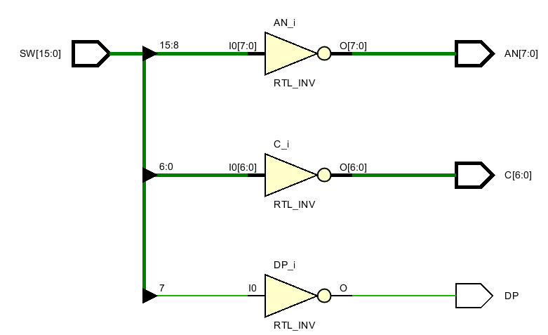

# Lab 2 7segment Display and Adders

Going to build a 7 seg display several different ways, then an adder, then a fast adder with fast carry logic and really use more of a CLB block than a LUT.

## Lab 2_0 Testing7SegDisplay

This lab is about turning off and on the individual red LED segments of the display, turning off and on the 8 displays on the Nexys4DDR board, and turning off and on the DP or decimal point. 

#### Port Interface

#### Verilog Code

#### 

#### RTL Schematic

#### Synthesis Schematic

#### Implementation Design Screen shot of something interesting

#### Testing

#### Prompts

*How is this project different from just hooking all the switches up to all the LEDs?*

*This project does something different from an output point of view than just selecting an LED. What output does something different?*

*Can the decimal place (DP) be moved to a different display than the display the number is appearing on?*

*Can all the displays display the same number once?*

*Can the displays capture and store different numbers?*

*How are the segments, the DP and the anodes behaving differently than the LED's?* 

*How would you modify segment, DP and/or anodes to make them behave like an LED?*

*Would this be more confusing or less confusing when looking at the verilog code?*

*What words are used by computer and electrical engineers to describe this behavior?*

*How many additional lines would have to be added to the XDC file (mostly commented out) to address each of eight displays, and each segment and decimal place on each display individually like the 16 LED's?* 

*Are these the same number of additional wires that would be needed coming out of the FPGA?*

## lab2_1_bcdTo7Segment

Constants are typically easy in other languages. In circuit design, constants are used too often. A constant can have four values:

​	0
​	1
​	x unknown
​	z high impedance (tri-state)

### Syntax

Verilog is case insensitive when specifying constants. In general, Verilog is case sensitive. 

Vivado tries to get rid of constants and change z into x at some point in the workflow. 

Integers can be written like constants in other programs such as  +3 -21, but you have no control over the bit width.  Negative numbers are represented by a 1 in the most significant bit  (MSB). 

Constants can be specified at the bit level in this format:

​			**[size] 'base value** 

**size** specifies the number of bits,   
**base** is one of o or O (octal), b or B (binary), d or D (decimal), h or H (hexadecimal),   
**value** is a sequence of digits which are valid for the specified base. 

For example,
wire [4:0] 5'O37 			11111
reg [3:0] 4'B1x_01 		1x01   the underscore _ is considered white space here
wire [11:0] 7'Hx 		 	 xxxxxxx 

Vivado does support the signed (MSB bit used as positive or negative) Verilog math golden rule:  [All operands must be signed](http://billauer.co.il/blog/2012/10/signed-arithmetics-verilog/). 

Vivado does not support signed constants that are defined in Verilog (using the MSB to keep track of positive and negative). 

Your goal is to develop a circuit with four BCD bits coming in and 7 bits leaving to support a 7 segment display.

CA, CB, CC, CD, CE, CF, CG and DP (decimal place), are all wired in parallel to each of the 8 displays. There are only 8 wires going from any circuit to all 8 displays. The AN (anodes) turn the 8 displays off and on. there is one AN wire going to each of the 8 displays. AN wires are active low, meaning a 0 turns them on and a 1 turns them off. 

#### Port Interface

#### Verilog Code

This circuit has nothing to do with choosing which of the 8 segments are being used. Another circuit is going to have to do that. But we need to turn them off in order to test this circuit. 

The obvious solution in verilog:

There is some logic behind this code. Look at the equation for seg(6) or g. Only three numbers turn off  segment g: **0, 1 or 7**,  **0001 or 0111**, (**~x[3] & ~x[2] & ~x[1]** ) |(**x[2] & x[1] & x[0]** ). 

Is this obvious to a electrical or computer engineer working in the field?  **Yes.** 

#### RTL Schematic

#### Synthesis Schematic

#### Implementation Design Screen shot of something interesting

#### Testing

#### Prompts

Was the <u>obvious solution</u> obvious to you? 

Did you see a verilog coding solution that was different than this one before looking at the code?

Did you understand the verilog code's logic above after reading it? 

Do these solutions blind you .. prevent you from seeing other solutions than the one above? 

BCD is easy compared to displaying in addition to 0,1,2,3,4,5,6,7,8,9 also displaying abcdEF of hex. Suppose you did this project to support hex also. Is this [scope creep](https://en.wikipedia.org/wiki/Scope_creep)? 

What is normal? For an engineer to create/see a complicated solution, and revisit the project requirements to see if the project is out of scope? Or design a minimal, elegant solution that perfectly matches the design requirements the first time? 

For seg[6] "g" , the first term is  (**~x[3] & ~x[2] & ~x[1]** ).  What BCD symbols (0,1,2,3,4,5,6,7,8,9)  is it creating a 1 for? 

For seg[6] "g" , the second term is  (**x[2] & x[1] & x[0]** ).  What BCD symbols (0,1,2,3,4,5,6,7,8,9)  is it creating a 1 for? 

Do these one's created for segment "g" of the display turn the g red LED off or on?

If the circuit receives a hex B, what is going to be displayed on the seven seg display designed for BCD?

## Lab2_2_hexToBCD

#### Port Interface

#### RTL Schematic

#### Synthesis Schematic

#### Implementation Design Screen shot of something interesting

#### Testing

#### Prompts

## Lab2_3_hexTo7seg

#### Port Interface

#### RTL Schematic

#### Synthesis Schematic

#### Implementation Design Screen shot of something interesting

#### Testing

#### Prompts

## Lab2_4_Adders

#### Port Interface

#### RTL Schematic

#### Synthesis Schematic

#### Implementation Design Screen shot of something interesting

#### Testing

#### Prompts

## Lab2_5_FastCarryLogic

#### Port Interface

#### RTL Schematic

#### Synthesis Schematic

#### Implementation Design Screen shot of something interesting

#### Testing

#### Prompts

## excetra

If the size specified is larger than the value for the specified constant, the number is padded to the left
with 0’s except for the case where the left most bit is x or z then the padding is done with x or z. 

If the size specified is smaller than the extra leftmost bits are ignored. 

If the size is not specified then it will use 32-bit data.

