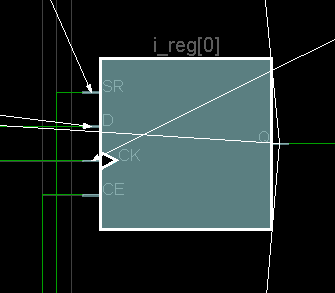
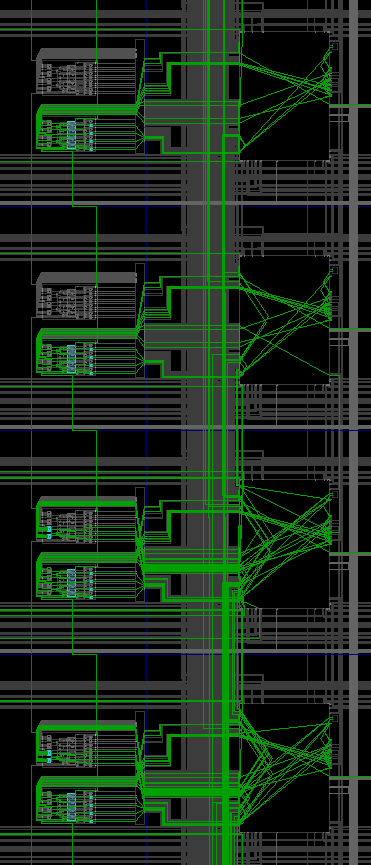
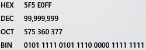
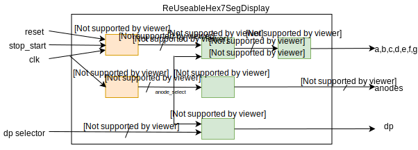

# Reusable BCD hex 7seg Display Code

The  HexToBCD algorithm in the last lab worked for one hex group. The problem is that it needs to be extended from 4 bits to 32 bits. Clocks and counters need to be added. The goal is to get that done here.

## 1_32bitHexTo16LEDs

This code tests the ability to count clock pulses and display 32 bits split into two groups of 16. SW[0] switches between the two groups. 

#### Port Diagram

#### Verilog Code

#### 

#### RTL Schematic Screen shot

#### 

#### Synthesis Schematic Screen shot

#### Implementation Device screen shot zoomed in on something interesting

First Flip Flops Being Used, 

Carry Logic Being used

#### Testing

___

#### Prompts

## 2_32bitBCDto16LEDs

Modify the above code using this [algorithm](https://pubweb.eng.utah.edu/~nmcdonal/Tutorials/BCDTutorial/BCDConversion.html) to work with 32 bits rather than 16. Which of these three is the starting point?  

In addition, modify the number of bits counted, and add an overflow if needed or a reset to the counter so it doesn't appear to count to a large number and then hang or do something strange. 

#### Port Diagram

#### Verilog Code

#### RTL Schematic Screen shot

#### Synthesis Schematic Screen shot

#### Implementation Device screen shot zoomed in on something interesting

#### Testing

 

------

#### Prompts

## 3_32bitsHexTo7segAnd16LEDs

This project is not yet finished. Please finish the documentation of it. It has  the switch between the two banks of 16 LEDs. Don't bother adding this to the port diagram. 

#### Port Diagram

#### Verilog Code

#### RTL Schematic Screen shot 

#### Synthesis Schematic Screen shot

#### Implementation Device screen shot zoomed in on something interesting

#### Testing

 

------

#### Prompts

## 4_32bitsHexToBCDto7segAnd16LEDs

Add your 32bitHextoBCD code to the above project. Replace any of the modules that you see with more attractive code. Add comments that make it easier to understand. 

#### Port Diagram

The SVG file called Port7Seg.svg can be uploaded to draw.io to edit. 

#### Verilog Code

#### RTL Schematic Screen shot

#### Synthesis Schematic Screen shot

#### Implementation Device screen shot zoomed in on something interesting

#### Testing

 

------

#### Prompts