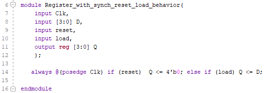
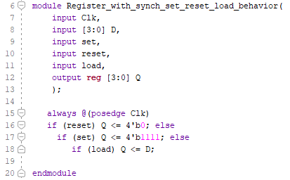
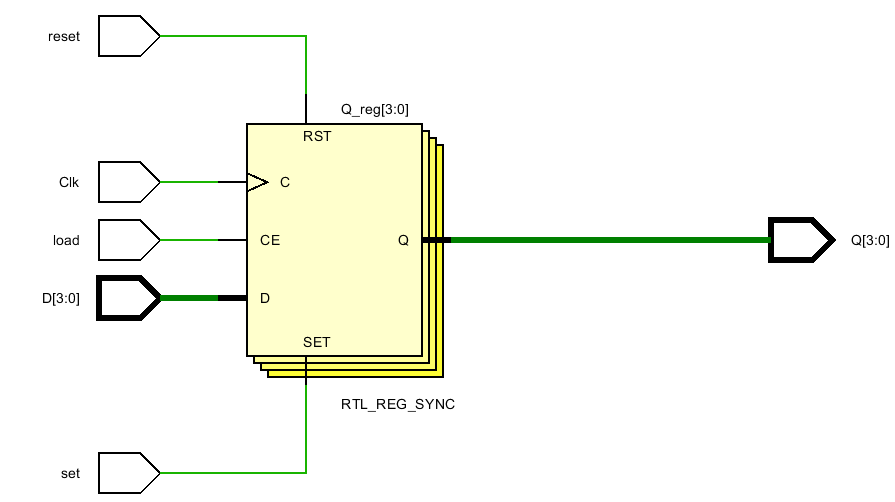
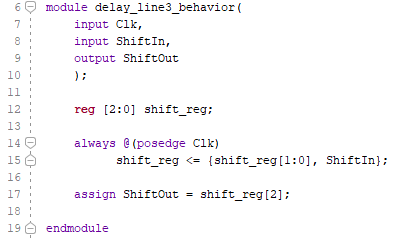
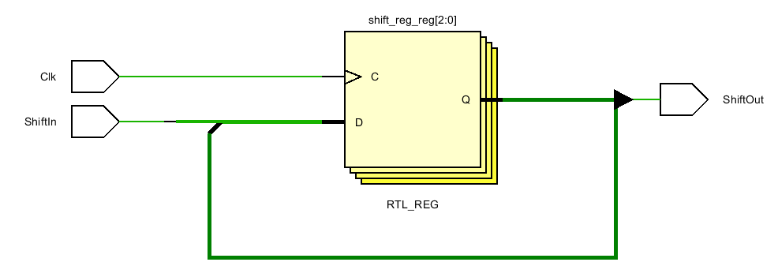
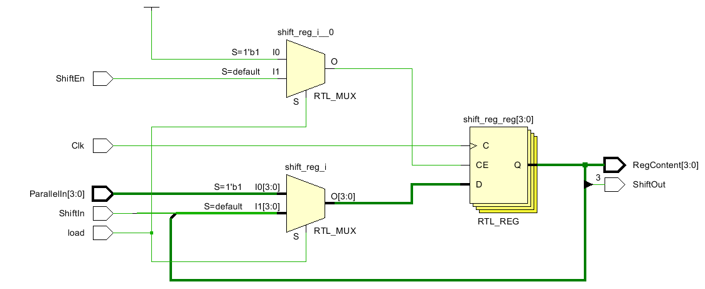

# Lab 6

## 1-1 4 bit register with synchronous reset

D flip flops differ in the bottom label. This one says RTL_REG_SYNC.

*Why is the load line connected to CE and the reset line connected to RST? Just because of the order in the if command?* Yes

## 1-2 Register with synch set reset load behavior 

*So there are three ways to control the register, RST, SET and load. And they have to be in the nest order of those if commands. This is strange .. but it makes it easier to remember. First Reset, then Set, then Load. What does Load do? What is CE?*

## 1-3 One Bit Delay

*The { } command above is where the shift occurs. Why not use >> or << ? Does it still work?* It normally shifts in 0's. To shift in ones, have to not, then shift, then not back. Also << shifts in more than one bit which would either be multiple 0's or multiple 1's, not a mixture. It's use is limited.

Why is this named RTL_REG rather than RTL_REG_SYNC like the ones above?

## 1-4 ShiftLeft

Again, we see RTL_REG.  *What is the difference between RTL_REG and RTL_REG_SYNC? Are we going to see a RTL_ASYNC?*

